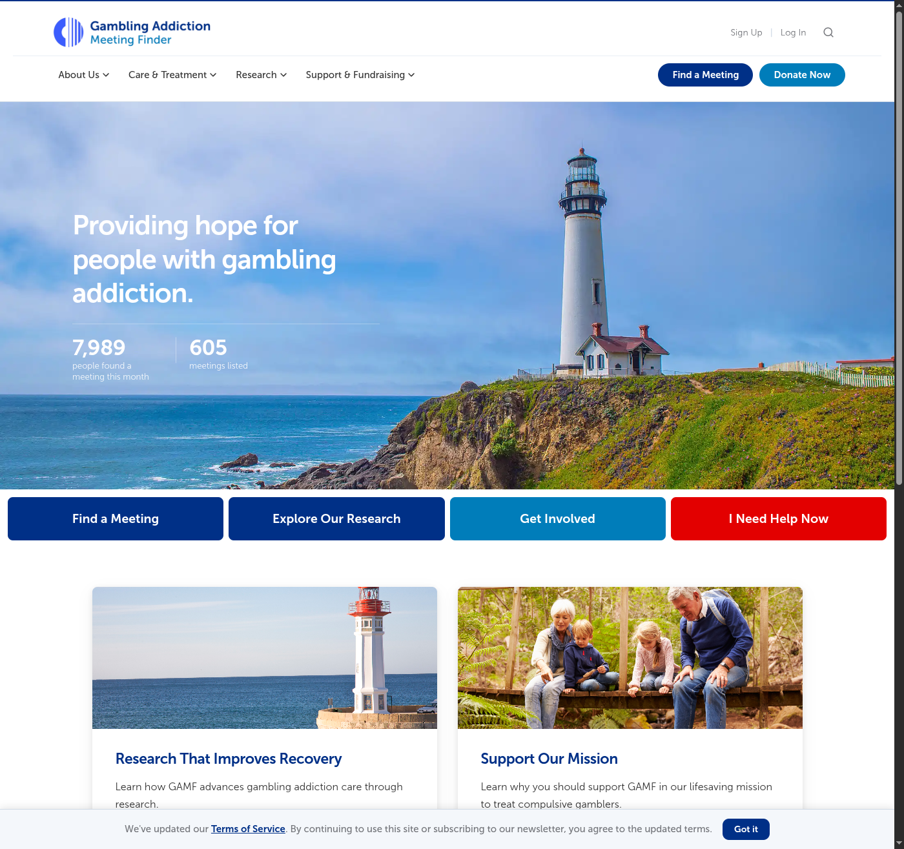
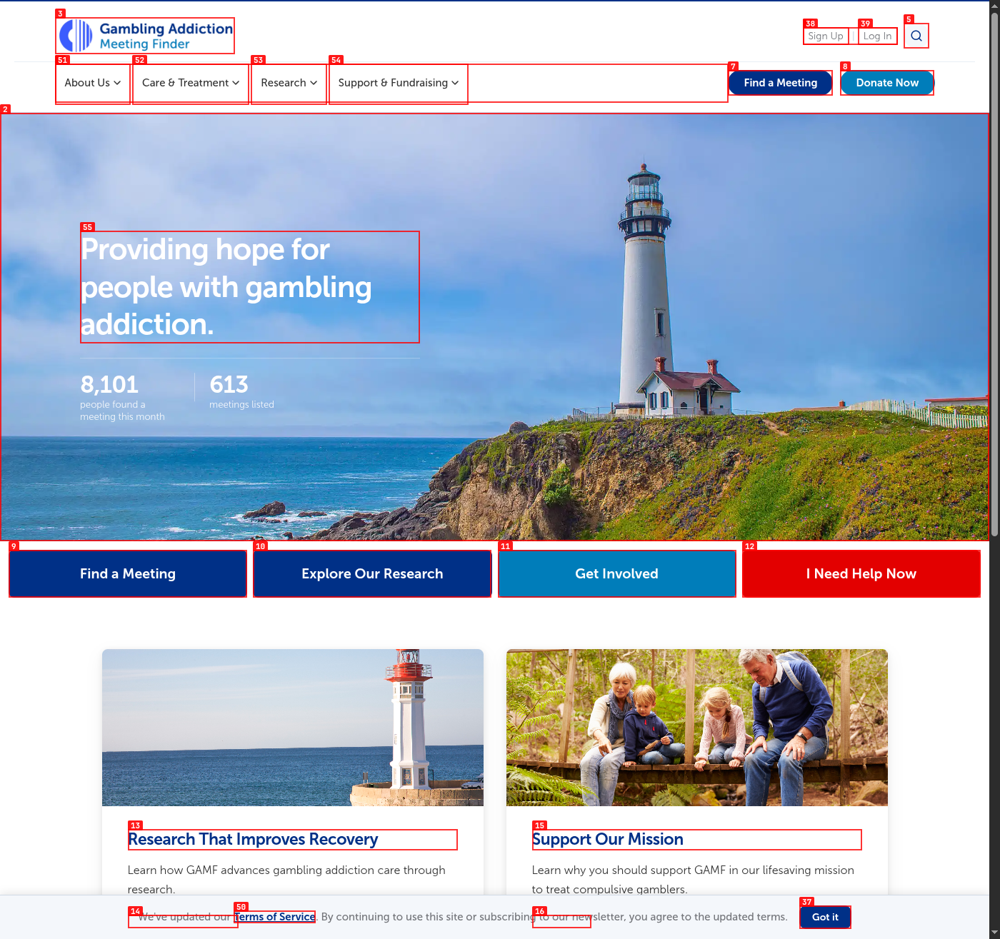
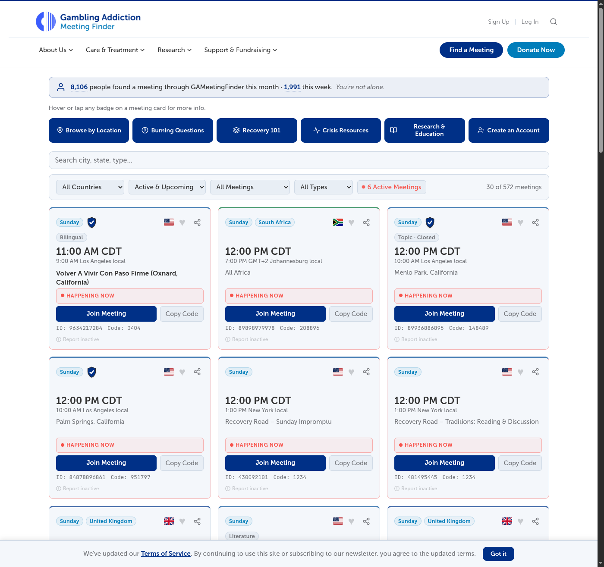
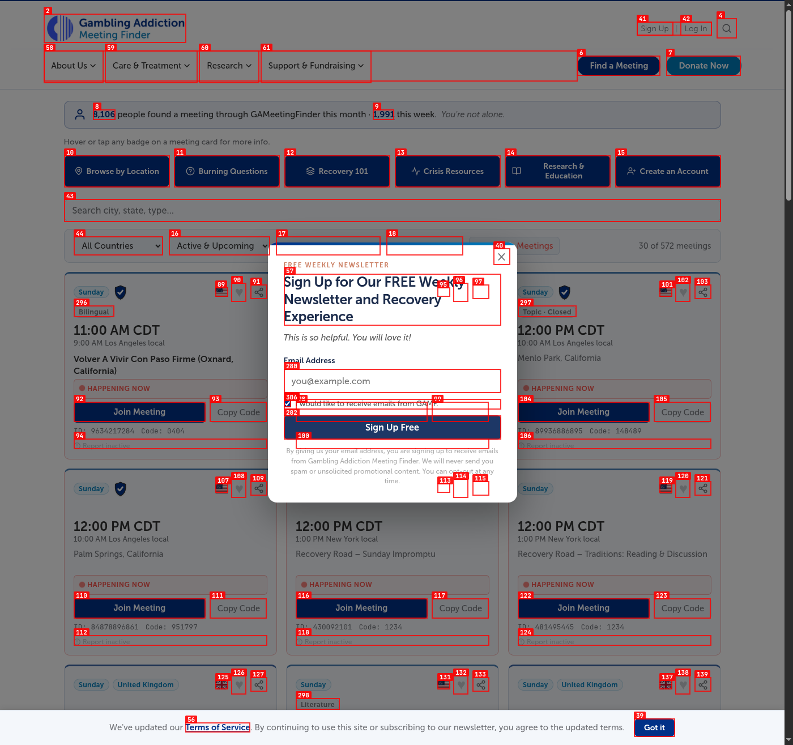
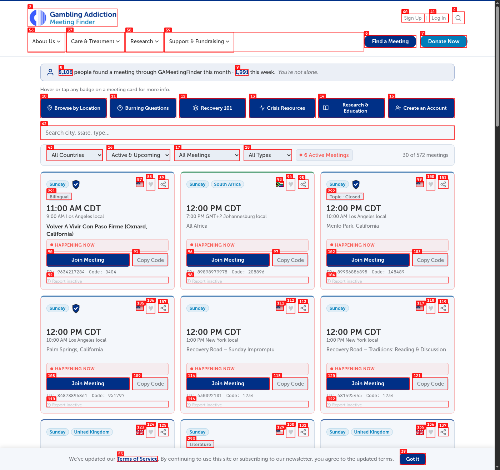
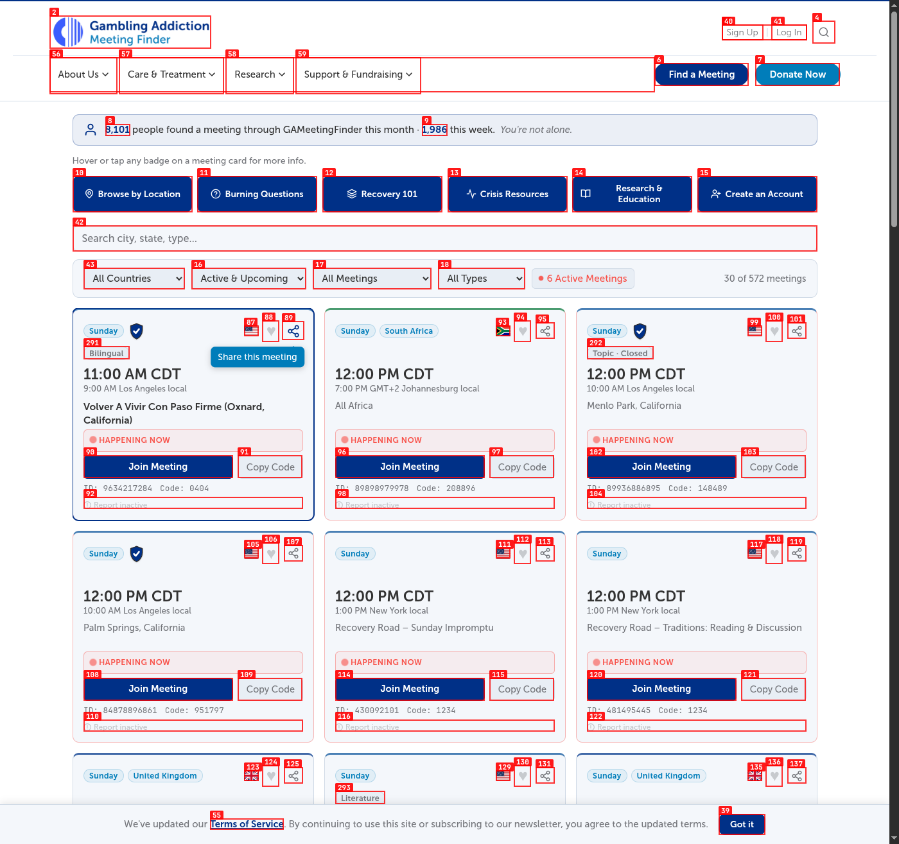
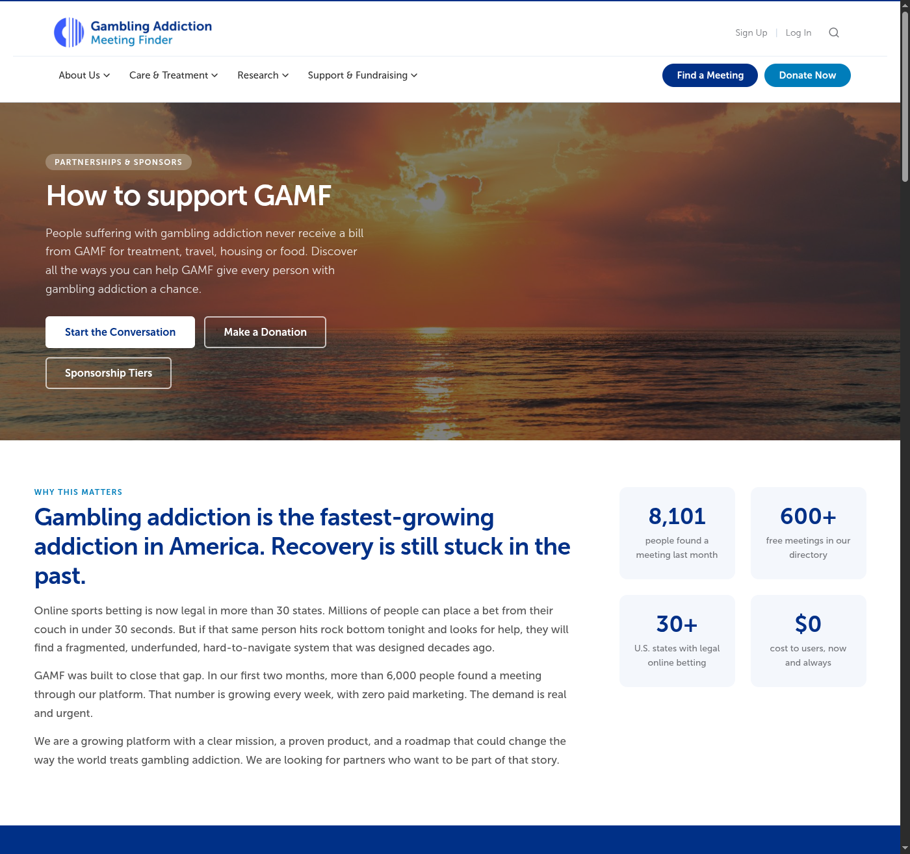
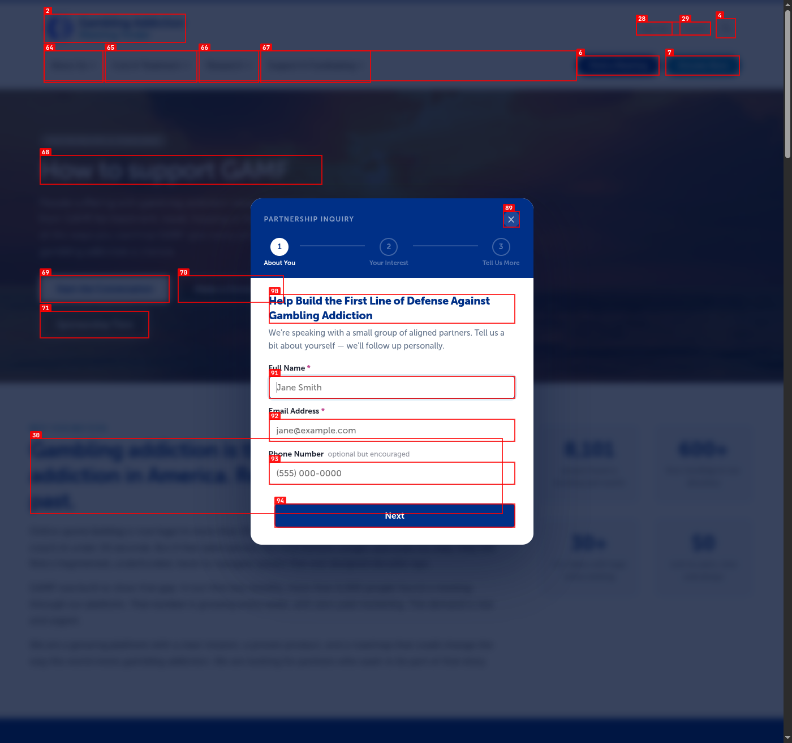

# Dogfood Report: Gameeting Finder

| Field | Value |
|-------|-------|
| **Date** | 2026-05-17 |
| **App URL** | https://www.gameetingfinder.com/ |
| **Session** | gameetingfinder-com |
| **Scope** | Public site exploration without authentication |

## Summary

| Severity | Count |
|----------|-------|
| Critical | 0 |
| High | 0 |
| Medium | 6 |
| Low | 0 |
| **Total** | **6** |

## Issues

Note: final verification was performed in a manually launched Chromium instance connected over CDP.

### ISSUE-001: Global "Search meetings" button does nothing when clicked

| Field | Value |
|-------|-------|
| **Severity** | medium |
| **Category** | functional |
| **URL** | https://www.gameetingfinder.com/ |
| **Repro Video** | N/A |

**Description**

The global `Search meetings` button is visible in the header, but clicking it on the homepage produces no navigation, no modal, no focus change, and no visible UI response. For a prominent primary action in the global header, that makes the control feel broken.

**Repro Steps**

1. Open `/`.
   

2. Click the `Search meetings` button in the header.

3. **Observe:** the page stays on the homepage and nothing new opens.
   

---

### ISSUE-002: Help and research pages route "find a meeting" actions to the homepage instead of the meeting directory

| Field | Value |
|-------|-------|
| **Severity** | medium |
| **Category** | functional |
| **URL** | https://www.gameetingfinder.com/resources and https://www.gameetingfinder.com/research |
| **Repro Video** | N/A |

**Description**

Several recovery-oriented links that imply they will take users to meetings actually point to `/` instead of `/find-a-meeting`. I confirmed this on both the Resources page (`find a virtual GA meeting`) and the Research page (`find a virtual GA meeting`, `← Find Meetings`, and footer `Find a meeting`). In high-urgency recovery flows, that sends users back to marketing content instead of directly to the meetings directory.

**Repro Steps**

1. Open `/resources`.
2. Find the sentence: `You can also find a virtual GA meeting`.
3. Inspect the link target.
4. Open `/research` and inspect `find a virtual GA meeting` and `← Find Meetings`.
5. **Observe:** these links point to `/`, not `/find-a-meeting`.

---

### ISSUE-003: Meetings landing page primary CTA routes back to the homepage

| Field | Value |
|-------|-------|
| **Severity** | medium |
| **Category** | ux |
| **URL** | https://www.gameetingfinder.com/meetings |
| **Repro Video** | N/A |

**Description**

On the main meetings landing page, the featured card says `Find a Meeting Happening Right Now` / `Join a Meeting Now`, but the CTA links to `/`. That creates a dead-end on the core browse page because the action returns users to the homepage instead of taking them to an immediately joinable meeting view.

**Repro Steps**

1. Open `/meetings`.
2. Locate the featured CTA card near the top of the page.
3. Inspect the `Join a Meeting Now` destination.
4. **Observe:** it links to `/` rather than a live meeting list or current-meetings filter.

---

### ISSUE-004: Newsletter modal auto-appears on the meeting directory and interrupts browsing

| Field | Value |
|-------|-------|
| **Severity** | medium |
| **Category** | ux |
| **URL** | https://www.gameetingfinder.com/find-a-meeting |
| **Repro Video** | N/A |

**Description**

On the live meeting directory, a newsletter signup modal appears automatically after a few seconds even when the user is actively browsing meetings. That blocks the core recovery workflow with a marketing interruption right in the highest-intent part of the site.

**Repro Steps**

1. Open `/find-a-meeting`.
   

2. Wait about 6 seconds without taking any action.

3. **Observe:** a `Sign Up for Our FREE Weekly Newsletter and Recovery Experience` modal appears over the meeting list.
   

---

### ISSUE-005: Meeting share action appears inert on the directory cards

| Field | Value |
|-------|-------|
| **Severity** | medium |
| **Category** | functional |
| **URL** | https://www.gameetingfinder.com/find-a-meeting |
| **Repro Video** | N/A |

**Description**

Each meeting card exposes a `Share this meeting` button, but clicking it on the live meeting directory produced no modal, no native share prompt, no copied state, and no visible feedback. That makes a high-value collaboration action feel broken.

**Repro Steps**

1. Open `/find-a-meeting` and locate a meeting card.
   

2. Click `Share this meeting` on the card.

3. **Observe:** the page remains unchanged and no sharing UI or confirmation appears.
   

---

### ISSUE-006: Partnership inquiry form marks fields with `*` but does not enforce them as required

| Field | Value |
|-------|-------|
| **Severity** | medium |
| **Category** | content |
| **URL** | https://www.gameetingfinder.com/partnerships |
| **Repro Video** | N/A |

**Description**

The partnership inquiry modal labels `Full Name *` and `Email Address *` with asterisks, but the actual fields are not marked required in the DOM and clicking `Next` does not surface any required-field validation. That creates a mismatch between what the form tells users and what it technically enforces.

**Repro Steps**

1. Open `/partnerships`.
   

2. Click `Start the Conversation` to open the inquiry modal.
   

3. Inspect the `Full Name *` and `Email Address *` fields or click `Next` without filling them.

4. **Observe:** the fields are labeled as required, but they are not technically required and no required-field validation is surfaced.

---
